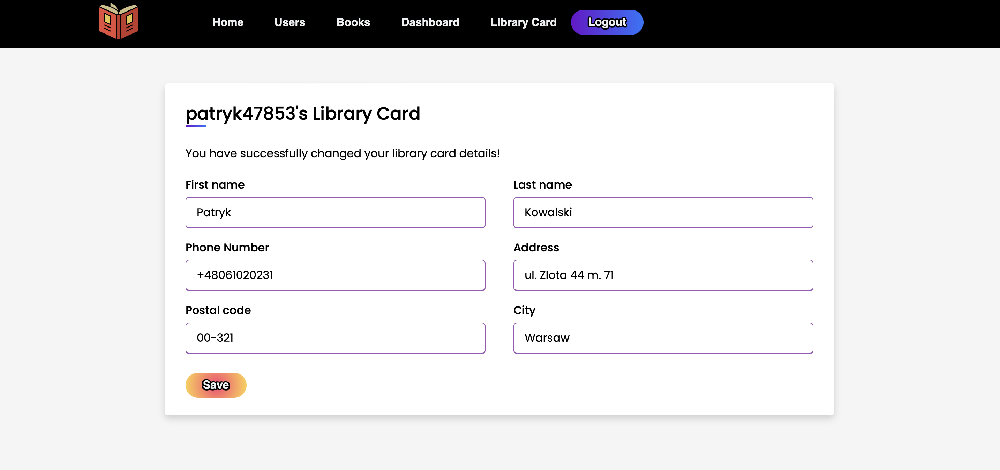

# 📚 MyLibrary System

* [📝 Description](#description)
  * [Overview](#overview)
  * [Discover the Features](#discoverfeatures)
* [🔧 Technologies & Frameworks](#technologies)
* [✨ Key Features](#features)
* [🚀 How to Run?](#howtorun)
  * [Google Books API](#booksapi)
  * [Database](#database)
  * [Project](#project)
* [📸 Screenshots](#screenshots)
* [📋 TO-DO List](#todo)

##  📠Description

###  Overview

Welcome to MyLibrary System - a library management system.

This is my first major and more complex project, which has provided me with valuable experience, knowledge, and significantly improved my learning process. It has allowed me to grasp various technologies and the underlying business logic. Currently, the project is still in the beta phase, although many crucial aspects have already been coded. You can find the current capabilities of my application in the ["Key Features"](#features) section, while the ["TO-DO"](#todo) section contains a list of items that will be implemented in the final version of this service.

The idea of creating such a service emerged rather serendipitously when I was contemplating a unique project that would allow me to independently implement both the business logic and the appearance and functionality of the application.

This project also provided me with the opportunity to explore and utilize a wide range of frameworks and tools that are commonly used in daily work, allowing me to gain practical experience with them.

There is still some work ahead on this project, but I am satisfied with the progress I have made so far.

Thank you for your time, and if you're reading this - I wish you a wonderful day! 😊

###  Discover the Features

📖 User-Focused Experience: Our system is based on four distinct roles:

* Users 📇: Anyone passionate about books can apply for a library card to become a reader and have access to all the essential features of our service.
* Readers 📚: With a library card, readers can explore our extensive collection and enjoy the full range of benefits our library has to offer.
* Librarians 📋: A select group entrusted with the responsibility to not only add new books to our library but also to facilitate the borrowing and returning process. They serve as the frontline heroes in managing the library's operations. Additionally, they play a pivotal role in ensuring smooth transactions, including handling payments for any overdue books.
* Admins 👩‍💼: These proficient individuals wield the power to administer the system with finesse. They have the authority to add, edit, and deactivate user accounts, maintaining the integrity of our library's operations.

##  🔧 Technologies & Frameworks

MyLibrary System is a fusion of popular technologies and frameworks:

🚀 Backend:

* Java 📚
* Spring Boot 🏃
* Hibernate 🗃️
* JUnit 🧪
* Spring Security 🔐
* Project Lombok 🧰
* Google Book API 📖
* Maven 🛠️

🎨 Frontend:

* HTML 🌐
* CSS 🎨
* Thymeleaf 🌼
* JavaScript 🪄 (just a little :))

These enchanting tools come together to power up our library management system. 📜📚✨

##  ✨ Key Features

Our library system comes packed with these features:

🔐 User Authentication and Authorization: Thanks to Spring Security, our system ensures security for user access and data protection.

📚 CRUD Operations: Administrators wield the power of Create, Read, Update, and Delete operations on books, users, and borrowing records. It's like a librarian's magic wand!

🔍 Google Book API Integration: Seamlessly, effortlessly, and elegantly, we fetch book information from the Google Book API, enriching our library's database.

🖥️ User-Friendly Web Interface: Our intuitive and visually appealing user interface, crafted with Thymeleaf, HTML, and CSS, welcomes users with open arms.

💾 Data Management: All your precious data finds a cozy home in our MySQL database, where it's efficiently managed and ready for action.

🧪 Unit Testing: JUnit takes the stage to conduct rigorous unit tests, ensuring code quality and reliability that's as solid as a well-bound book.

These features come together to create a library experience like no other! 📖🌟

##  🚀 How to Run?

* ###  Google Books API

If you need guidance on obtaining a Google Books API key, you can watch a short and clear instruction video [here](https://www.youtube.com/watch?v=s_G5CnAu69M).

Once you have your API key, open the application.properties file and locate the line that says google.books.api.key=. Paste your API key there.

* ###  Database

In [MySQL Workbench](https://www.mysql.com/products/workbench/) go to:

File -> Run SQL Script...

and then select "database.sql" script. Press Run. That's it!

* ###  Project

1. Clone this git repository: `$ git clone https://github.com/patryk47853/MyLibrary-System.git`
2. Fetch all Maven dependencies.
3. Remember about updating Google Books API key and running database.sql file!
4. That's it! MyLibrary service will be available under URL `http://localhost:8080/login`

##  📸 Screenshots

* #### Login page

* #### Register page

* #### Home page - logged as user

* #### Apply for Library Card - logged as user

* #### Library Card has been created - logged as user

* #### Home page - logged as reader

* #### Change Library Card's details - logged as reader

* #### Librarian dashboard - logged as librarian

* #### Search books via Google Books API - logged as librarian

* #### Book found - but no cover and no info covered by Google Books API

* #### Book found - with cover and info covered by Google Books API

* #### Home page - logged as admin

* #### List of users - logged as admin

##  📋 TO-DO List

- [x] Implement user authentication and authorization using Spring Security.
- [x] Enable CRUD operations for users.
- [x] Integrate Google Book API for seamless book information retrieval.
- [x] Design a user-friendly web interface with Thymeleaf, HTML, and CSS.
- [x] Establish efficient data management with MySQL database integration.
- [x] Conduct unit testing with JUnit for code quality and reliability.
- [ ] Create functionality to add books to database.
- [ ] Create a history of borrowed/reserved books to track past transactions.
- [ ] Establish reservation system.
